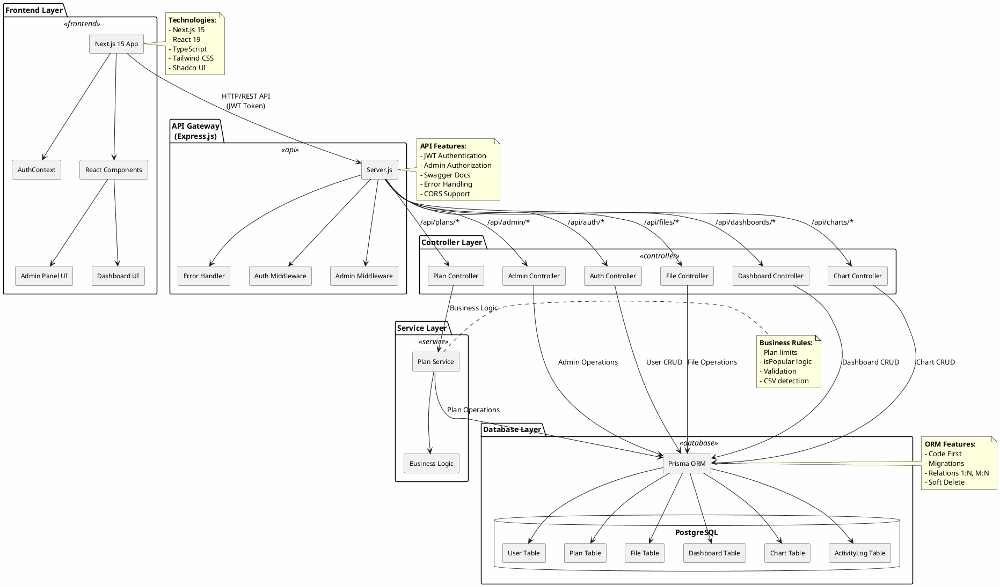
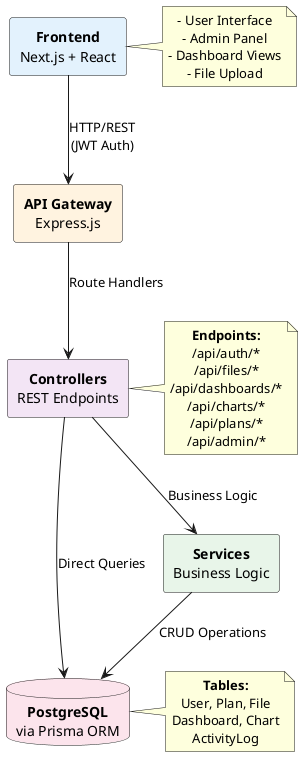
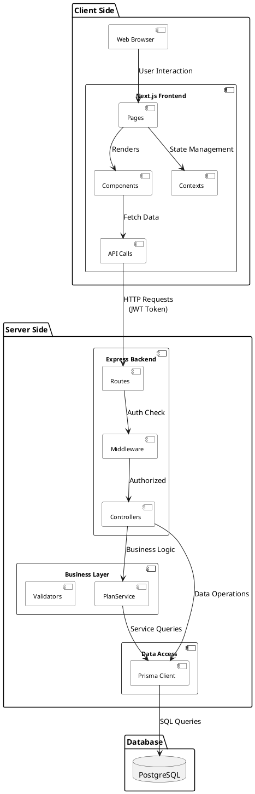
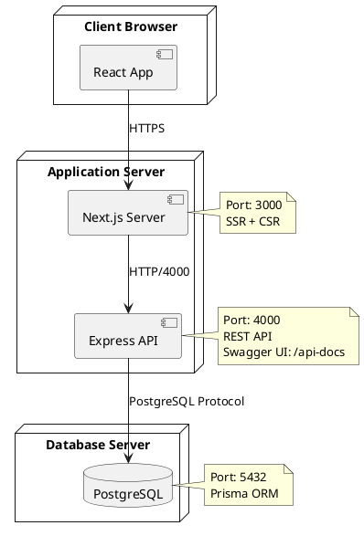
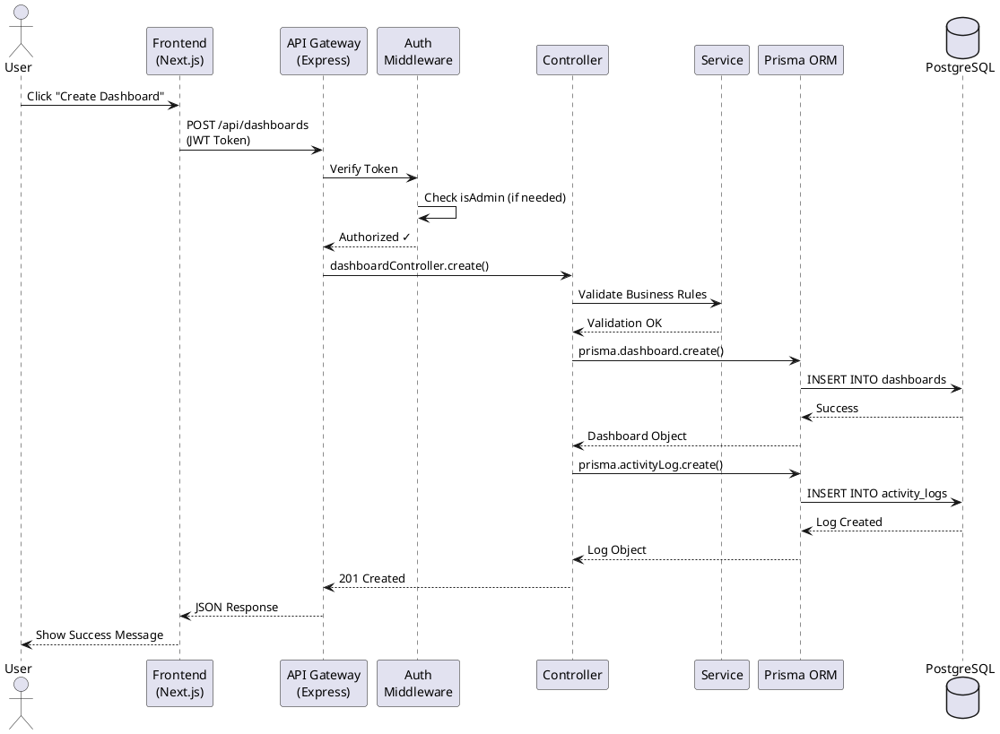
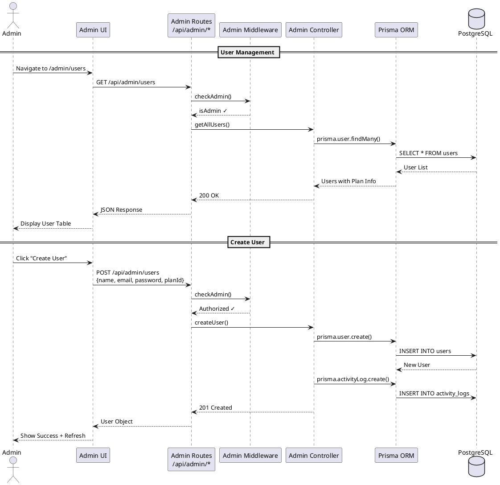

# DataInsight Dashboard - Architecture Diagram

## Alternative: Simplified Architecture Diagram

## Detailed Component Diagram

## Deployment Architecture

## Request Flow Sequence Diagram

## Admin CRUD Architecture

## Usage

### Online Tool

1. Accesează https://www.plantuml.com/plantuml/uml/
2. Copiază codul PlantUML de mai sus
3. Lipește în editor
4. Vezi diagrama generată
5. Export ca PNG/SVG

### VS Code

1. Instalează extensia "PlantUML" (jebbs.plantuml)
2. Deschide acest fișier
3. Apasă `Alt+D` pentru preview
4. Export: Right-click → Export Current Diagram

### Documentație

Include diagrama exportată în `DOCUMENTATIE_PPAW.md` la secțiunea ARHITECTURĂ.

---

**Creat:** Ianuarie 2026
**Tool:** PlantUML
**Format:** Markdown + PlantUML DSL
