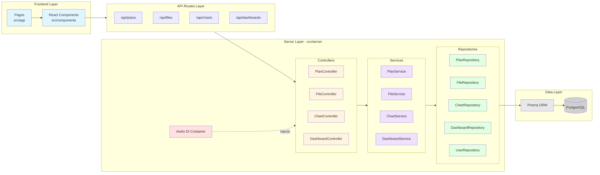

# Arhitectura MVC - DataInsight Dashboard

Acest fișier conține diagrama vizuală pentru arhitectura MVC a aplicației.

---

## Arhitectura MVC - Component Diagram

Această diagramă arată structura generală a aplicației și cum comunică componentele între ele.



---

## Legendă Culori

- 🔵 **Albastru** - Frontend/UI Layer
- 🟡 **Galben** - Controller Layer (HTTP)
- 🟣 **Violet** - Service Layer (Business Logic)
- 🟢 **Verde** - Repository Layer (Data Access)
- 🔴 **Roșu** - Infrastructure (DI Container)
- ⚪ **Gri** - Database Layer

---

## Flow-ul arhitectural:

```
Frontend (React Components)
    ↓
API Routes (/api/*)
    ↓
Controllers (HTTP Handling)
    ↓
Services (Business Logic)
    ↓
Repositories (Data Access)
    ↓
Prisma ORM
    ↓
PostgreSQL Database
```

**Dependency Injection**: Toate componentele sunt gestionate de containerul Awilix care injectează automat dependențele necesare.
